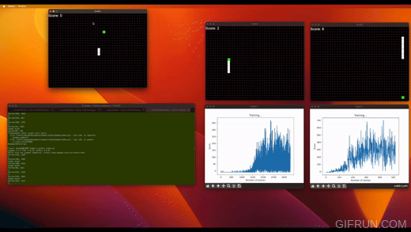

# Deep Reinforcement Learning: Building Games from Scratch

**Author:** Amjad Yousef Majid  
**Contact:** amjad.y.majid@gmail.com

  

This repository houses a collection of games that are created from the ground up to train Deep Reinforcement Learning (DRL) agents. These games, programmed in Python and Pygame, provide an enriching environment for DRL agents to learn and develop. The DRL agents themselves are built utilizing Pytorch. 

To highlight the standalone nature of this project, **no Gym or Gymnasium libraries have been employed.**

## Classic Reinforcement Learning Scenarios
Explore the world of traditional reinforcement learning through various scenarios. The objective in each case is to navigate a grid world to reach a specified destination using different algorithms:

1. [Value Iteration algorithm](https://github.com/amjadmajid/deep-reinforcement-learning-games-from-scratch/tree/main/01_Reinforcement_learning/01_ValueIteration)
2. [SARSA algorithm](https://github.com/amjadmajid/deep-reinforcement-learning-games-from-scratch/tree/main/01_Reinforcement_learning/02_SARSA)  
3. [Q-learning algorithm](https://github.com/amjadmajid/deep-reinforcement-learning-games-from-scratch/tree/main/01_Reinforcement_learning/03_Qlearning)  

## Deep Reinforcement Learning Scenarios
Delve deeper into more complex scenarios where DRL agents tackle challenging tasks, from navigating mazes to mastering the game of Snake:

1. Navigating a [grid world using DQN](https://github.com/amjadmajid/deep-reinforcement-learning-games-from-scratch/tree/main/02_Deep_reinforcement_learning/Gridworld_DQN)
2. Navigate a Maze using [Policy Gradient REINFORCE algorithm](https://github.com/amjadmajid/deep-reinforcement-learning-games-from-scratch/tree/main/02_Deep_reinforcement_learning/REINFORCE)
3. Playing [Snake using DQN with a linear neural network (FNN)](https://github.com/amjadmajid/deep-reinforcement-learning-games-from-scratch/tree/main/02_Deep_reinforcement_learning/Snake_DQN/01_Snake_DQN_FNN)
4. Playing Snake with [DQN (or DDQN) with convolution neural networks (CNNs)](https://github.com/amjadmajid/deep-reinforcement-learning-games-from-scratch/tree/main/02_Deep_reinforcement_learning/Snake_DQN/02_Snake_DQN_CNN)

This project provides a powerful platform for those seeking to understand the inner workings of reinforcement learning and its advanced derivative - deep reinforcement learning. It showcases the potential of these AI techniques by employing them in engaging and relatable game scenarios.